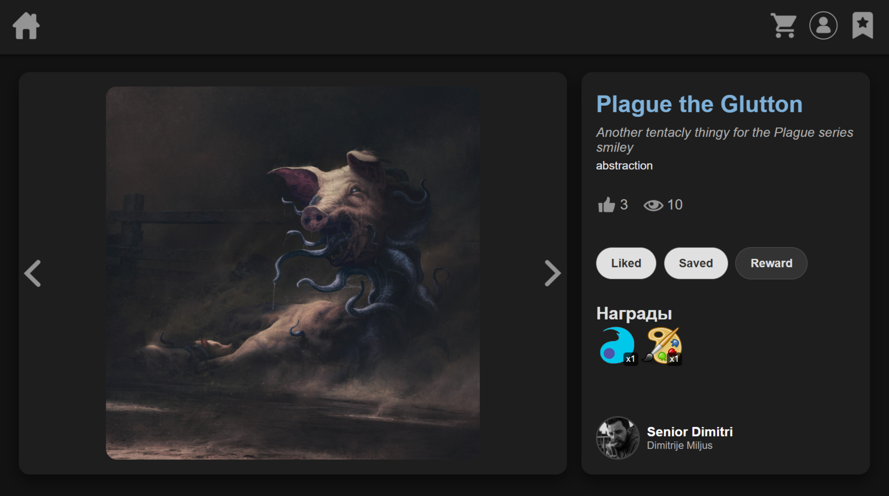

# Arthub

A web application for promoting artists. Registered artists can publish their works, and users can rate the works they like, as well as save them to favorites.

In addition, there is a system for supporting artists. Users can reward works that "resonate with them" with awards in exchange for points. These points can be earned by users for activities on the site, such as for a certain number of likes per day. Artists receive points for the awards given by users. With these points, they can customize their profiles, as well as promote their artworks by purchasing beautiful frames (which will be visible in the feed). This way, highly-rated artworks will stand out on the main page, and their artists will gain greater visibility and promotion.

## Technology stack

 - Backend: C#, self-written framework based on HttpListener,  an analog of ASP.NET 
 - Frontend: without frameworks
 - Database: PostgreSQL
 - S3 storage: MinIO
 - ORM: self-written MicroORM based on ADO.NET, an analog of Dapper
 - Tests: Moq

## Screenshots
Main page with a feed of artists' works
  

  

Page with a job and information about it
  

  

Profile page with information about the artist and his portfolio
  

  

Shop page with frames and backgrouds
  

  

